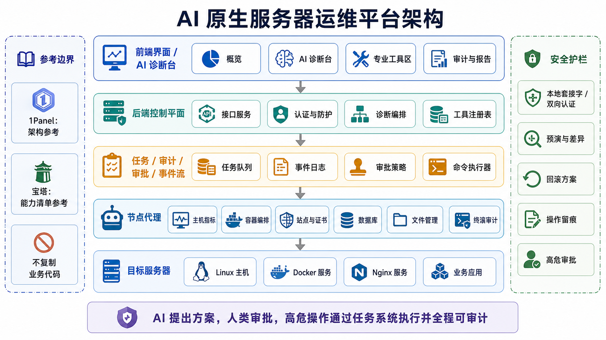

# AI 原生服务器运维面板

本项目目标是规划并实现一个面向中小团队的 AI 原生服务器运维面板。

第一阶段不再保留旧的静态演示页面，开发重点转向真实 MVP：

- 单台 Linux 服务器巡检
- Docker / Nginx / systemd 诊断
- 日志与安全风险检查
- AI 诊断编排
- 受控工具执行
- 审批式修复
- 审计与巡检报告

规划产物位于 `.omx/`：

- `.omx/context/`：上下文快照
- `.omx/plans/`：PRD、测试规格和后续共识规划

## 架构图



## 技术栈

- 后端：Python 3.12、FastAPI、Pydantic、SQLite、pytest
- 前端：React、TypeScript、Vite
- AI：默认 mock/fixture 模式；设置 `AIOPS_LLM_MODE=deepseek` 后可通过 DeepSeek OpenAI-compatible API 接入真实模型

### DeepSeek 真实模型配置

不要把 API Key 写进仓库或前端。只在后端运行环境设置：

```bash
export AIOPS_LLM_MODE=deepseek
export AIOPS_LLM_API_KEY_FILE="/仅后端可读的路径/deepseek_api_key"
export AIOPS_LLM_BASE_URL="https://api.deepseek.com"
export AIOPS_LLM_MODEL="从认证后的 GET /models 返回值中选择"
export AIOPS_DEEPSEEK_THINKING="enabled"
```

本仓库正式生产 Compose 只通过 secret file 注入 Key；直接设置
`AIOPS_LLM_API_KEY` / `AIOPS_DEEPSEEK_API_KEY` 仅用于本地开发或由外部
secret manager 提供的受控运行环境，并且不得写入 `.env`、Compose、日志
或 shell history。

接入后，诊断链路会由真实模型选择白名单只读工具、读取真实工具结果并生成报告。R0 的重启、写入、恢复和防火墙等 mutation 全部 disabled；只有后续 Node Agent、审批、执行验证与破坏性实验门禁通过后才能逐项启用。
- 部署：本地优先，Docker Compose 默认绑定 `127.0.0.1`

## 本地开发

```bash
./scripts/dev.sh
```

默认管理员：

- 用户名：`admin`
- 初始密码：`BootstrapPassword123!`

调试阶段默认启用 `AIOPS_DEBUG_SKIP_PASSWORD_CHANGE=1`，登录后直接进入功能页。

## 验证

```bash
./scripts/smoke.sh
```

## Docker Compose

```bash
docker compose up -d
```

开发 Compose 只绑定本机回环地址，但镜像内部已改为正确的容器监听和
`backend:8080` 服务发现。前端镜像使用多阶段构建并由非 root Nginx
提供静态文件，不再运行 Vite dev server。

## R0 生产部署基线

生产配置与本地开发配置严格分离：

```bash
cp .env.production.example .env.production
./scripts/verify-production-baseline.sh
docker compose --env-file .env.production -f deploy/compose.prod.yml config
```

首次安装还需要短时 setup override；完整步骤见
`docs/runbooks/README.md`。生产容器使用 TLS、Docker secret files、非 root
用户、只读根文件系统、capability drop、healthcheck、restart policy 和
资源上限。

生产文档真源：

- `docs/architecture/README.md`
- `docs/security/threat-model.md`
- `docs/support-matrix.md`
- `docs/provenance.md`
- `.omx/specs/r0-production-baseline.md`

### 当前明确 NO-GO

R0 只是生产基线，不是 GA。独立 Worker/Node Agent 尚未实现，所有
mutating/destructive placeholder capability 必须保持 disabled；当前部署
不得声称能真实修改宿主机。以下证据完成前禁止公网正式投产：

- Ubuntu clean-VM 安装、镜像 digest/SBOM/签名和依赖/容器扫描；
- DeepSeek/OpenAI-compatible `/models`、tool-calling、脱敏与数据条款 live probe；
- 版本化迁移、异地备份恢复、可观测性、升级/回滚和完整 CI/CD；
- R1-R7 的 Agent、任务、安全、领域能力、UI、试点和 soak/canary gate。

生产配置不得使用默认值，必须通过 secret files 设置会话/LLM/TLS 材料，
并使用 HTTPS trusted origin。特别禁止：

- bootstrap admin password；
- `AIOPS_DEBUG_SKIP_PASSWORD_CHANGE=1`；
- 容器 privileged、Docker socket、宿主根目录或 Agent socket 挂载；
- 把 mock LLM、placeholder success 或静态 Compose 校验当成生产证据。
